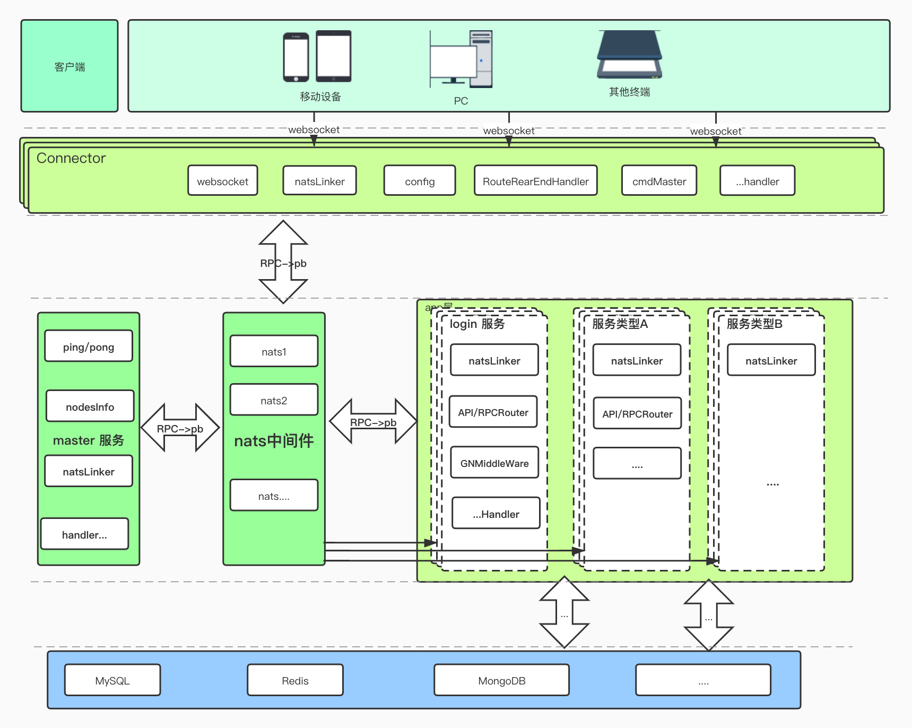

# GN
###### GN是由golang开发的一个 轻量级，上手简单的游戏服务器框架。  <br>
###### GN的RPC调用采用了消息中间件nats，后期可能会扩展纯RPC框架 如GRPC或者gnet等 目前还在酝酿中。<br>
###### GN 的名字正是golang和nats中间件的首字母而来 <br>


--------------
# GN 框架图



--------------

# GN 简介
## 1：GN 服务简介
GN 游戏框架，目前主要分为 三种 游戏服务器类型  connector服务类型，APP服务类型，master服务类型 ，另外包含一中间件nats 服务。<br>


* `connector服务`:连接器服务-》可以理解为 客户端连接后端服务器集群的前端网关服务，主要做客户端socket通道管理，消息的路由 以及中转消息包等相关业务逻辑，不涉及具体的业务逻辑开发，目前支持websocket 连接，后续会扩展其他连接。该服务通常会根据业务需求，扩展该服务节点数。

* `APP服务`:游戏主服务-》 游戏业务的主服务，几乎所有的业务逻辑以及开发接口，都需要此对象注册，一个前端或RPC 消息包Ipack的流程处理，中间件，group 等等，也都由APP 对象管理。通常该服务类型，有多个 APP服务，来组成游戏集群，供其他服务调用。而config配置文件的servers->"id":"login-001",来确定该服务的唯一性，serverType,来确定 该APP服务类型，多个相同serverType，组成一组相同功能的游戏服务。其他服务根据路由算法确定 调用其中一个游戏服务。


* `master服务`:master服务 正如其名 其他游戏服务的master节点，主要用来 ping/pong 其他服务节点信息来检测 以及获取其他服务节点自动数据返回，如查看内存活跃用户，等等，但是需要用户自己注册handler 返回自定义数据，该服务 不是必要条件，可以根据需求 判断是否启动该服务。该服务  通常为一个节点 获取所连接子节点的相应API 调用。


* `nats 服务`:nats是一个高性能，易使用，轻量级 golang开发的 中间件服务，GN主要用来做 消息中转服务，而不需要每个服务节点之间 都连接socket。nats默认
不支持 消息落盘服务，这样也会影响性能，用户可以根据 自定义 自己选择是否需要落盘

## 2: handler API & RPCAPI
GN可以根据自己后端API需求，轻松简单实现 该API是 单独协程处理业务逻辑，还是公用一个协程排队处理，如：<br>
```go
APIRouter(router string, newGoRoutine bool, handlerFunc ...HandlerFunc)
RPCRouter(router string, newGoRoutine bool, handlerFunc HandlerFunc)
```
使用样例：
```go
app.APIRouter("addGroup", true, addGroup)
app.APIRouter("createGroup", true, createGroup)
app.RPCRouter("rpcGetAllGroups", false, rpcGetAllGroups)
```

## 3: GN 名词 及 重要component 组件简介 
* `IPack组件`: APP游戏服务-》 通讯消息包的封装或者路由的上下文的封装，该消息包从收到到最终逻辑处理完毕，的整个流程的上下文。

* `Group组件`: App游戏服务-》group组件 正如其名，可以把他看成一个组，比如一个聊天室，或者房间都可以做一个组，该group主要用来存储 connector 服务的session等信息，该组件支持群发消息，添加用户session，删除session，等相关方法。该group KEY-》group 方式 存储在APP  对象的内存中，重启会丢失。

* `GNMiddleWare组件` :APP游戏服-》中间件，包含Before(IPack)，After(IPack) 两个方法，主要是用来全局，处理Ipack消息包的前置拦截或者后置的消息的处理 操作。

* `config组件`: APP游戏服务/connector服务/master服务-》游戏集群服务的配置文件，nats 配置文件，connector，APP，等相关服务器的配置 ，服务启动需要设置路径，并根据config模块 启动各个服务

* `Viper组件`: APP游戏服务-》业务逻辑相关 配置文件，该github-》 viper 支持json，yaml等格式的配置文件，viper 配置可以在APP服务启动前设置，比如：
    app.AddConfigFile("test", "../../config/", "yaml")。  

* `Session组件`:APP游戏服务-》session 主要为后端业务逻辑服务，用来绑定前端connector服务的连接ID和 用户逻辑ID绑定而出现的。session：包含 1）连接服的websocket 连接ID，2）用户BindID，3）所在前端服务器的唯一serverID。该session 可用group组件 统一保存在内存，并维护。用户断线重连 该session和老session可能会重复，需要用户自己处理

* `glog Log组件`: APP游戏服务/connector服务/master服务-》 该log 模块 是根据 golang 官方log包，修改以及包装而来，log模块相关配置可以直接在 config配置文件配置，如果不配置，默认为 终端重开输出，不会输出为文件，该log模块 默认一个协程 处理log 的写入。避免因为写入log影响其他模块的性能。

* `CMDHandler方法`: APP游戏服务/connector服务-》该方法主要是用来注册cmdAPI  func (a *App) CMDHandler(cmd string, handler HandlerFunc)  主要 用来 接收master  服务的cmd 命令，然后根据需求，返回 master方法，该方法master 对应的方法：SendCMD(cmd,nodeId,string data []byte),cmd为注册的唯一 API名字，需要唯一，master的SendCMD为协程阻塞方法。

* `ILinker 连接器组件`:APP游戏服务/connector服务/master服务-》ILinker 连接器，为 各个 服务节点 连接nats中间件的   封装，主要用发送和接收消息包。
该 ILinker 接口实现为 natsLinker，后续会有其他 连接器如GRPC Linker

* `WSConnection 客户端连接器组件`:connector服务-》 客户端连接 服务器集群connector 服务的 ，封装，主要用来接收，和发送 消息包到 客户端！ 该实现 为github.com/gorilla/websocket 的封装

* `GnExceptionDetect 异常处理组件`:APP游戏服务/connector服务/master服务-》该组件 用来 注册 各个服务异常的回调的函数注册，样例如下：
```go 
	// exception handler
	connector.AddExceptionHandler(func(exception *gnError.GnException) {
		// close handler push msg
		if exception.Exception == gnError.WS_CLOSED && len(exception.BindId) > 0 && len(exception.Id) > 0 {
			handlerName := "wsclose"
			serverAddress := connector.GetServerIdByRouter(handlerName, exception.BindId, exception.Id,
				config.GetServerByType("login"))
			connector.SendPack(serverAddress, handlerName, exception.BindId, exception.Id, nil)
		}
	})
```
    所有exception异常 请在gnError包查看


------------
## 4:GN master 服务 样例及说明
#### 目前GN master 模块 并没有 增加 启动，重启以及管理的 子节点的功能，而是简单的添加了  探知各个子节点，ping/pong心跳机制，以及master RPC 远程调用  其他子节点的注册函数，返回相应的 信息，以供开发者 获取 子节点对应的 子服务的信息。 例子如下：<br>
``` go 
	// master 实例代码  master 调用   login-001 服务商的 online 方法
	// routine  master  不要阻塞主协程
	go func() {
		for {
			time.Sleep(3 * time.Second)
			req := message.CmdOnlineReq{
				Admin: "test",
				Msg:   "test test test",
			}
								// 参数说明 cmd： API名字 ，需要唯一性， 明确指出 RPC  调用的APIname
								// nodeId ：服务唯一ID，具体参考 配置文件
								// obj  : RPC  远程调用的参数 
			results, err := master.SendCMDJson("online", "login-001", req)
			if err != nil {
				logger.Infof("master.SendCMD online error  %v   \n ", err)
				return
			}
			if len(results) > 0 {
				res := &message.CmdOnlineRes{}
				jsonI.Unmarshal(results, res)
				logger.Infof("master.SendCMD -- online  results  %v ", res)
			}

		}
	}()

	// 节点 login-001 实现  online  方法 实例
	// master cmd  command
	app.CMDHandler("online", func(pack gn.IPack) {
		req := &message.CmdOnlineReq{}
		logger.Infof("online Cmd--    %v \n", string(pack.GetData()))
		if err = jsonI.Unmarshal(pack.GetData(), req); err == nil {
			logger.Infof("  online    req    %v \n ", req)
			if req.Admin == "test" {
				response := &message.CmdOnlineRes{
					ServerId: "login-001",
					Msg:      "onLine test  test",
				}
				logger.Infof("  online    response    %v \n ", response)
				pack.ResultJson(response)
			}
		}
	})

```


------------
## 5: GN APP 服务 样例及说明
#### GN APP 


------------
## 6: GN Connector 服务 样例及说明
#### 目前 Gn Connector 中仅仅支持 websocket 连接，并使用 github.com/gorilla/websocket 该包，connector 包中  


------------

## 7: Nats 消息中间件服务 说明
#### 目前 Gn Connector 中仅仅支持 websocket 连接，并使用 github.com/gorilla/websocket 该包，connector 包中  


------------

# 快速上手及 demo


 #### [gnchatdemo](https://github.com/wmyi/gnchatdemo "gnchatdemo")
 ------------
# API & interface 说明

